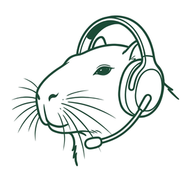

<p align="center">
  
</p>

<h1 align="center">CoZe — Consultant Zertifizierung</h1>

<p align="center">
  <em>The unofficial "driver's license exam" for Microsoft 365 Copilot Consultants.</em><br/>
  <strong>29 questions · 45 minutes · up to 10 mistakes allowed · do you pass?</strong>
</p>

<p align="center">
  
  
  
  
</p>

---

## What is CoZe?

**CoZe (Consultant Zertifizierung)** is a satirical quiz modelled after the German driving theory exam — but instead of traffic rules, it tests knowledge of **Microsoft 365 Copilot Consulting**.

Topics covered include:

- 🧠 **Grounding & Prompt Engineering** — Why does an agent return nonsense when a SharePoint folder contains 6,000 neglected documents?
- 🔐 **Privacy & Oversharing** — What happens when Copilot surfaces confidential HR data in a Teams search?
- 🏛️ **Governance & Compliance** — How do you respond to a stale knowledge base that returns references to deleted sites?
- 📊 **Adoption & Change Management** — Why a single 45-minute training session is not enough for sustainable Copilot adoption.
- 🤖 **AI Hallucinations** — When Copilot gets creative and fabricates figures.

Each question has **one correct answer** and three plausible-but-wrong distractors. The distractors are intentionally exaggerated — because humour aids retention.

> **Disclaimer:** This is **not** an official Microsoft certification. It is an independent community project for learning and entertainment purposes only. It has no affiliation with Microsoft Corporation or any employer of the author. All trademarks belong to their respective owners.

---

## Key Features

- ⚡ **Zero dependencies** — no build step, no `node_modules`, no bundler required.
- 🌐 **Multi-language support** — UI strings and question content are fully externalised into `locales/` JSON files (`en.json`, `de.json`).
- 🏠 **Local-first** — runs entirely in the browser; no server, no backend, no data collection.
- ⏱️ **45-minute countdown** — auto-submits when time expires.
- ⭐ **Question flagging** — bookmark difficult questions to review later.
- 🔄 **Review mode** — step through all answers with colour-coded corrections after submission.
- 📊 **Detailed results** — mistake count, error rate, time used, and per-question breakdown.
- 🖼️ **Scenario images** — every question is accompanied by a themed cockpit-view image to reinforce the driving exam metaphor.
- 📱 **Responsive design** — works on desktop, tablet, and mobile.

---

## Screenshots

<p align="center">
  
  
</p>

---

## Project Structure

```
CoZe/
├── index.html          # Application entry point (intro, quiz, results, modal)
├── index.css           # All styling — no CSS framework
├── index.js            # Quiz logic, question catalogue, timer, navigation
├── locales/
│   ├── en.json         # English UI strings and question content
│   └── de.json         # German UI strings and question content
├── images/
│   ├── logo-seal.png   # Capybara mascot (transparent background)
│   ├── favicon.png     # Browser tab icon
│   ├── q01.jpg         # Scenario image for question 1
│   └── …               # q02.jpg … q29.jpg
└── screenshots/        # Documentation and preview images
```

---

## Quick Start

No build tool or package manager is needed.

### Clone and open locally

```bash
# Clone via SSH
git clone git@github.com:leichtin/CoZe.git
cd CoZe

# Open directly in the browser
open index.html          # macOS
xdg-open index.html      # Linux
start index.html         # Windows
```

### VS Code Live Server (recommended for development)

1. Install the [Live Server](https://marketplace.visualstudio.com/items?itemName=ritwickdey.LiveServer) extension.
2. Open the `CoZe` folder in VS Code.
3. Click **Go Live** in the status bar — the app reloads automatically on file changes.

### GitHub Pages (production)

The `main` branch root is served directly via GitHub Pages. Push your changes to `main` and the live site updates automatically.

---

## Contributing & Translations

Contributions are welcome. To add or update a language:

1. Copy an existing locale file as a template:
   ```bash
   cp locales/en.json locales/<lang>.json
   ```
2. Translate all string values. Do **not** change JSON keys.
3. Register the new locale in `index.js` (look for the language-switcher section).
4. Open a pull request with your changes.

For bug reports and feature requests, please open a [GitHub Issue](https://github.com/leichtin/CoZe/issues).

---

## Technology Stack

| Layer | Technology |
|-------|-----------|
| Structure | HTML5 |
| Styling | CSS3 (vanilla) |
| Logic | Vanilla JavaScript (ES2020+) |
| Fonts | Google Fonts — Inter, Poppins, Share Tech Mono |
| Icons | Font Awesome 6 |
| Hosting | GitHub Pages |

---

## License

This project is licensed under the **MIT License** — see [LICENSE](LICENSE) for details.
